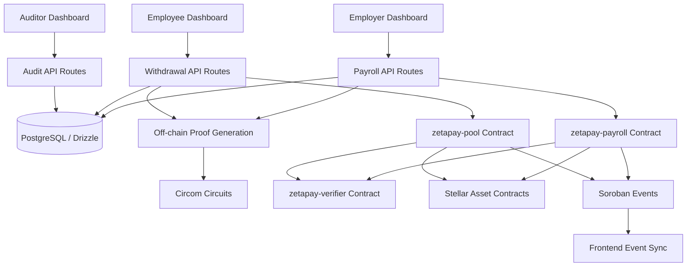

# ZetaPay

ZetaPay is a privacy-preserving payroll settlement platform built on Stellar and Soroban. It lets an employer create payroll batches, prove payroll correctness with zero-knowledge proofs, settle payments in XLM or USDC, and support shielded withdrawals through a private pool.

The project combines Soroban smart contracts, Groth16 proofs, Circom circuits, a Next.js dashboard, PostgreSQL storage, wallet integration, event-driven updates, tests, and CI/CD workflows.

## Features

- Employer, employee, and auditor dashboards.
- Confidential payroll batch settlement for XLM and USDC.
- Shielded pool payroll with note deposits, Merkle roots, nullifiers, and private withdrawals.
- Groth16 proof verification on Soroban using BN254 pairing checks.
- Inter-contract communication between payroll/pool contracts and the verifier contract.
- Contract events for important state changes.
- Frontend event utilities for Soroban event polling, cursor tracking, and reconnect backoff.
- API routes for payroll, employees, audit verification, withdrawals, settings, and Stellar balance checks.
- PostgreSQL schema and migrations managed with Drizzle ORM.
- GitHub Actions workflows for frontend, contracts, circuits, security checks, release, and deployment.
- Deployment scripts, rollback scripts, health checks, and environment templates.

## Technology Stack

| Area            | Technology                                         |
| --------------- | -------------------------------------------------- |
| Blockchain      | Stellar, Soroban                                   |
| Smart contracts | Rust, `soroban-sdk`                                |
| ZK circuits     | Circom, Groth16, snarkjs, BN254                    |
| Frontend        | Next.js 16, React 19, TypeScript, Tailwind CSS     |
| Backend         | Next.js API routes                                 |
| Database        | PostgreSQL, Drizzle ORM                            |
| Auth/session    | Supabase helpers and cookie-based session handling |
| Wallet/network  | Stellar SDK, Freighter integration                 |
| CI/CD           | GitHub Actions, Vercel deployment scripts          |

## Architecture



### Application Layers

- **Frontend:** role-based dashboards for employers, employees, and auditors.
- **API layer:** validates user actions, creates payroll records, prepares proofs, and calls Soroban contracts.
- **Database:** stores app-level payroll metadata, employees, audit logs, and verification records.
- **ZK layer:** generates and verifies payroll and shielded withdrawal proofs.
- **Smart contract layer:** verifies proofs, enforces access control, records commitments/nullifiers, and settles tokens.
- **Event layer:** emits and consumes contract events so the UI can synchronize with on-chain state.

## Smart Contracts

The Soroban contracts live in `contracts/`.

### `zetapay-verifier`

Location: `contracts/zetapay-verifier`

Purpose:

- Verifies Groth16 proofs on BN254.
- Exposes a reusable verifier interface for other contracts.
- Checks verification key shape before pairing verification.

Key function:

- `verify(vk, proof, public_inputs) -> Result<bool, VerifierError>`

### `zetapay-payroll`

Location: `contracts/zetapay-payroll`

Purpose:

- Manages confidential payroll batch submission and execution.
- Calls `zetapay-verifier` to validate payroll proofs.
- Verifies payment totals against public proof inputs.
- Prevents duplicate proof reuse.
- Prevents double execution of the same payroll batch.
- Transfers XLM or USDC to payroll recipients.
- Tracks payroll run summaries.
- Emits events for initialization, batch submission, and batch execution.

Important functions:

- `initialize`
- `submit_batch`
- `execute_batch`
- `submit_and_execute_batch`
- `get_payroll_record`
- `get_payroll_run_summary`

Security controls:

- Employer authorization with `require_auth`.
- Initialization guard.
- Non-empty payroll validation.
- Encrypted payroll payload validation.
- Proof replay protection.
- Public-input and payment-total consistency checks.
- One-time batch execution.

### `zetapay-pool`

Location: `contracts/zetapay-pool`

Purpose:

- Supports shielded payroll deposits and private withdrawals.
- Registers supported token contracts.
- Accepts Merkle roots for valid note sets.
- Stores shielded note commitments.
- Prevents duplicate commitments.
- Verifies withdrawal proofs through `zetapay-verifier`.
- Prevents double spends through nullifier hashes.
- Transfers withdrawn funds to recipients.
- Emits events for initialization, token registration, root acceptance, deposits, and withdrawals.

Important functions:

- `initialize`
- `register_token`
- `post_root`
- `fund_payroll`
- `deposit_note`
- `deposit_notes`
- `withdraw_with_proof`
- `get_note`
- `get_withdrawal`
- `get_stats`

Security controls:

- Admin authorization with `require_auth`.
- Registered-token enforcement.
- Positive-amount validation.
- Commitment uniqueness.
- Accepted-root validation.
- Nullifier double-spend protection.
- Proof/public-input validation before withdrawal.

## Event Streaming

The contracts emit Soroban events for important state changes:

| Contract | Event topic | Meaning                      |
| -------- | ----------- | ---------------------------- |
| Payroll  | `init`      | Payroll contract initialized |
| Payroll  | `submit`    | Payroll batch submitted      |
| Payroll  | `execute`   | Payroll batch executed       |
| Pool     | `init`      | Pool contract initialized    |
| Pool     | `token`     | Token registered             |
| Pool     | `root`      | Merkle root accepted         |
| Pool     | `deposit`   | Shielded note deposited      |
| Pool     | `withdraw`  | Shielded note withdrawn      |

Frontend event utilities are implemented in:

- `src/lib/zetapay/contracts/events.ts`
- `src/lib/zetapay/contracts/events.test.ts`

The event utilities handle:

- Soroban `getEvents` request construction.
- Contract-scoped event filtering.
- Event kind normalization.
- Cursor merging.
- Reconnect backoff.

## Project Structure

```text
.
├── .github/
│   ├── actions/                 # Shared CI setup actions
│   └── workflows/               # CI, security, release, and deployment workflows
├── circuits/
│   ├── payroll/                 # Payroll batch circuit and fixtures
│   └── pool/                    # Deposit and withdrawal circuits
├── contracts/
│   ├── zetapay-verifier/        # Groth16 verifier contract
│   ├── zetapay-payroll/         # Payroll settlement contract
│   └── zetapay-pool/            # Shielded pool contract
├── deploy/
│   └── environments/            # Environment variable examples
├── docs/
│   ├── ci-cd/                   # CI/CD and deployment documentation
│   ├── screenshots/             # Demo screenshots
│   └── production-readiness-report.md
├── drizzle/
│   └── migrations/              # Database migrations
├── scripts/
│   ├── ci/                      # CI validation scripts
│   ├── contracts/               # Contract initialization scripts
│   └── deploy/                  # Frontend deployment, rollback, health checks
└── src/
    ├── app/                     # Next.js routes and API routes
    ├── components/              # UI and dashboard components
    ├── config/                  # App configuration
    ├── hooks/                   # React hooks
    └── lib/                     # DB, Stellar, ZK, contract, and security utilities
```

## Environment Variables

Copy `.env.example` to `.env` and fill in the values for your environment.

```bash
cp .env.example .env
```

Required variables:

| Variable                          | Purpose                                |
| --------------------------------- | -------------------------------------- |
| `NEXT_PUBLIC_SUPABASE_URL`        | Supabase project URL                   |
| `NEXT_PUBLIC_SUPABASE_ANON_KEY`   | Public Supabase anon key               |
| `SUPABASE_SERVICE_ROLE_KEY`       | Server-side Supabase service key       |
| `DATABASE_URL`                    | PostgreSQL connection string           |
| `DIRECT_URL`                      | Direct PostgreSQL migration connection |
| `NEXT_PUBLIC_APP_URL`             | App URL used by server-side flows      |
| `TOKEN_ENCRYPTION_KEY`            | 32-byte hex key for encrypted tokens   |
| `NEXT_PUBLIC_STELLAR_NETWORK`     | Stellar network, usually `testnet`     |
| `NEXT_PUBLIC_SOROBAN_RPC`         | Soroban RPC endpoint                   |
| `NEXT_PUBLIC_STELLAR_HORIZON_URL` | Stellar Horizon endpoint               |
| `STELLAR_SOURCE_ACCOUNT`          | Stellar CLI deployer identity alias    |
| `ZETAPAY_VERIFIER_CONTRACT_ID`    | Deployed verifier contract ID          |
| `ZETAPAY_PAYROLL_CONTRACT_ID`     | Deployed payroll contract ID           |
| `ZETAPAY_POOL_CONTRACT_ID`        | Deployed pool contract ID              |
| `NEXT_PUBLIC_XLM_TOKEN_CONTRACT`  | Stellar native asset contract ID       |
| `NEXT_PUBLIC_USDC_TOKEN_CONTRACT` | USDC asset contract ID                 |

Generate `TOKEN_ENCRYPTION_KEY` with:

```bash
openssl rand -hex 32
```

## Installation

Prerequisites:

- Node.js `22.22.1` or newer.
- Yarn 1.x.
- Rust stable.
- Stellar CLI.
- PostgreSQL database.
- Circom/snarkjs toolchain if rebuilding proof artifacts.

Install dependencies:

```bash
yarn install --frozen-lockfile
```

Install the Rust target used by Soroban:

```bash
rustup target add wasm32v1-none
```

Run database migrations:

```bash
yarn db:migrate
```

Start the app:

```bash
yarn dev
```

Open:

```text
http://localhost:3000
```

## Smart Contract Workflow

Build contracts:

```bash
yarn contracts:build
```

Run all contract tests:

```bash
yarn contracts:test
```

Deploy contracts to Stellar testnet:

```bash
yarn contracts:deploy
```

Initialize deployed contracts:

```bash
yarn contracts:initialize:all
```

After deployment, update `.env`:

```text
ZETAPAY_VERIFIER_CONTRACT_ID=<deployed verifier contract id>
ZETAPAY_PAYROLL_CONTRACT_ID=<deployed payroll contract id>
ZETAPAY_POOL_CONTRACT_ID=<deployed pool contract id>
```

Resolve token contract IDs:

```bash
stellar contract id asset --network testnet --asset native
stellar contract id asset --network testnet --asset USDC:<issuer>
```

## Testing

Frontend event utility tests:

```bash
yarn test:frontend
```

TypeScript check:

```bash
yarn type-check
```

ESLint:

```bash
yarn lint:check
```

Formatting:

```bash
yarn format:check
```

Rust formatting:

```bash
cd contracts
cargo fmt --all -- --check
```

Rust clippy:

```bash
cd contracts
cargo clippy --workspace --target wasm32v1-none -- -D warnings
```

All contract tests:

```bash
cd contracts
cargo test --workspace -- --nocapture
```

Local verification from the latest readiness pass:

```text
Frontend tests: 3 passed, 0 failed
Contract tests: 17 passed, 0 failed
TypeScript: passed
ESLint: passed
Prettier: passed
Rust fmt: passed
Rust clippy: passed
Production build: passed
```

## CI/CD


## Deployment

Frontend deployment is handled through Vercel scripts:

```bash
bash scripts/deploy/deploy.sh development
bash scripts/deploy/deploy.sh staging
bash scripts/deploy/deploy.sh production
```

Health check:

```bash
bash scripts/deploy/health-check.sh <deployment-url>
```

Rollback:

```bash
bash scripts/deploy/rollback.sh production
```

Deployment configuration examples are stored in:

```text
deploy/environments/development.env.example
deploy/environments/staging.env.example
deploy/environments/production.env.example
```

## Contract Deployment Evidence

Use this section to record live deployment results after deploying to Stellar.

| Item                            | Value                                                      |
| ------------------------------- | ---------------------------------------------------------- |
| Network                         | `testnet`                                                  |
| Verifier contract ID            | `CAIZXZZ6SCPKZ5O2677O7BNKM5VBZPWNSGG3MSA5PUIX7K6P4XJV7NRY` |
| Payroll contract ID             | `CDBMRZZWIAD2REFZXMH2K3FZUF5YTLD5H67NHB64ZYALAVCK24SKNFOK` |
| Pool contract ID                | `CBOCTHV6GAQ47JKTAYPWOQYPBL5E2NYC7XEJRSBLCFIMVCQSY3EAH55I` |
| Initialization transaction hash | `<fill after initialization>`                              |
| Sample payroll transaction hash | `<fill after contract interaction>`                        |
| Sample pool transaction hash    | `<fill after contract interaction>`                        |

## Demo Walkthrough

1. Connect as an employer.
2. Add employees, contractors, or vendors.
3. Create a payroll run and select recipients.
4. Generate a payroll proof.
5. Submit the payroll batch on-chain.
6. Execute direct settlement or fund the shielded pool.
7. Watch status updates through emitted contract events.
8. Connect as an employee and view payroll status.
9. For shielded payroll, prepare and submit a withdrawal proof.
10. Connect as an auditor and verify payroll records using audit views.

Screenshots are stored in:

```text
docs/screenshots/
```

## Production Readiness Notes

The project includes a detailed readiness report:

```text
docs/production-readiness-report.md
```

Important operational notes:

- Do not commit real `.env` files or private keys.
- Store deployer credentials in GitHub/Vercel secrets.
- Record deployed contract IDs and transaction hashes after testnet/mainnet deployment.
- Run GitHub Actions after pushing to confirm hosted CI results.
- Add coverage tooling before reporting exact coverage percentages.
- Move long-running proof generation to a worker queue for high-volume production usage.

## Troubleshooting

### Missing environment variables

Run:

```bash
node scripts/ci/validate-env.mjs
```

Then compare `.env` with `.env.example`.

### Contract build fails

Check:

```bash
rustup target add wasm32v1-none
stellar --version
cd contracts && cargo check --workspace
```

### Frontend build warns about proof scripts

The proof generation module invokes witness/proof scripts at runtime. The app can still build, but production deployments should keep proof artifacts available and eventually move proof generation into a worker service.

### Lockfile or dependency issues

Use Node.js `22.22.1` or newer:

```bash
node --version
yarn install --frozen-lockfile
```

## License

This project is private unless a license file is added.
